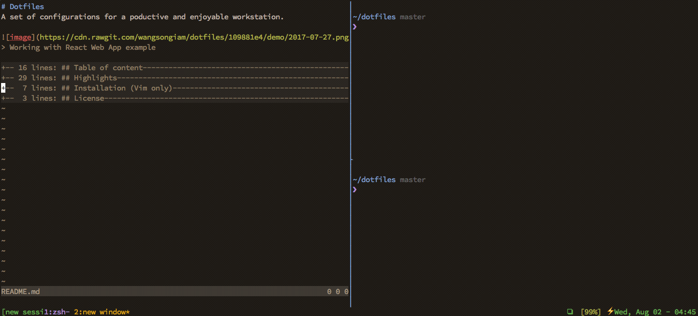
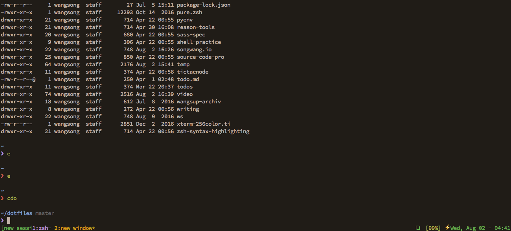

# Dotfiles
A set of configurations for a poductive and enjoyable workstation.


> Working with React Web App example

## Table of content

|  Name| Filepath |
|:--|:--|
| Neovim (over engineered) | [init.vim](./nvim/init.vim) |
| Vim | [.vim/](./.vim/) |
| Tmux | [.tmux.conf](./.tmux.conf) |
| iTerm | [iterm.json](./iterm.json) |
| Zshell | [zsh/](./zshrc) |
| Karabiner-Element | [karabiner.json](./karabiner.json) |
| Hammerspoon | [.hammerspoon](./.hammerspoon/) |
| Git | [.gitconfig](./.gitconfig) |
| Xcode | [.xvimrc](.xvimrc) |
| VSCode Editor |[.code/](./.code)  |
| Atom Editor (Deprecated in April, 2017) | [.atom/](./.atom) |

## Highlights
### demos

> fuzzy finding a session with cmd key shortcut
---


> toggle maximux with cmd enter


> new window


> new session with prompting name


> navigating panes
### Neovim 
  * async completion
  * dimmed line number and status bar for low contraction
  * fzf and ag inplemented for directory, in-file, cross file level searching
### Tmux 
  * prompting name when creating new window/session
  * themed
### iTerm
  * vim navigation
  * remapped `cmd` key mappings for vim and tmux
  * themed
### Zshell
  * autocompletion
### Hammerspoon
  * Monitor Swithcing `<cmd-esc>`
  * Scoped shortcuts for Apps 
  * Window Moving/Resizing `<alt-hjkl>`
  * syncrinezd emmet key binding for all editors `<c-g>`
  * systemwise vim flavored navigation and editing
    * `<c-hjkl>` for arrows
    * `<c-w>` for deleting one word back
    * `<c-q>` for deleting one line back
    * `<c-d>` for deleting one word forward
    * `<c-a>` and `<c-e>` for jumping to the beginning and end
    * `<c-f>` for jumping one word forward
    * `<c-b>` for jumping one word back


## Installation (Vim only)
make sure you know what [this](https://github.com/wangsongiam/dotfiles/blob/master/install.sh) means and have git installed

```
$ curl -fsSL https://raw.githubusercontent.com/wangsongiam/dotfiles/master/install.sh | sh
```

## License
This repo is fully under [MIT Lincese](LICENSE), by that you can do almost
anything you want with it.
